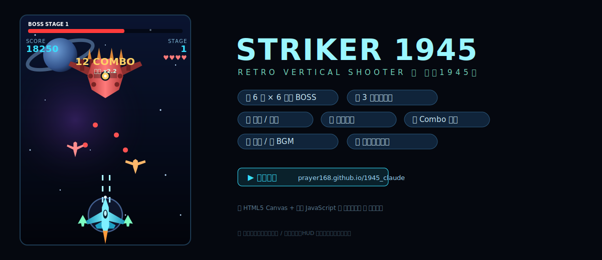

# STRIKER 1945 — 仿《1945》射擊遊戲

純 HTML + Canvas + 原生 JavaScript 打造的垂直捲軸射擊遊戲，**零外部資源、單一檔案**即可遊玩。電腦、平板、手機瀏覽器皆支援。

## 🎮 線上遊玩
👉 **https://prayer168.github.io/1945_claude/**

📖 **完整玩法說明** → [遊戲說明.md](遊戲說明.md)

## 操作方式
| 動作 | 鍵盤 | 觸控（手機） |
|---|---|---|
| 移動 | 方向鍵 / `W A S D` | 拖曳畫面 |
| 射擊 | 自動發射 | 自動發射 |
| 切換武器 | `1` `2` `3` | 右下「武器」鈕 |
| 巡弋飛彈 | `M` | 右下「飛彈」鈕 |
| 炸彈（清屏） | `空白` / `B` | 右下「炸彈」鈕 / 雙擊畫面 |
| 暫停 / 繼續 | `P` / `Esc` | HUD 上方 ⏸ 鈕 |

標題畫面可選 **難度**、切換 **🔊 音樂**、進入 **⛶ 全螢幕**。

## 三種武器（互有取捨）
| 武器 | 鍵 | 定位 |
|---|---|---|
| **火神砲** | `1` | 均衡全能，穩定前方火力 |
| **雷射** | `2` | 高速貫穿，單體／直線最強（打 Boss 利器），覆蓋窄 |
| **散彈** | `3` | 寬扇形掃群，近戰猛，遠距／單體弱 |

## 道具
`P` 火力升級（最高 4 級）・`W` 換武器・`O` 僚機（最多 2 架同步開火）・`S` 保護罩（限時無敵）・`C` 巡弋飛彈補充・`B` 炸彈・`♥` 補血

## 遊戲特色
- **6 大關卡**：各關專屬背景色調、太空場景（行星／星雲／隕石），波次由易到難、時間線拉長
- **6 隻大型母艦 Boss**：後掠主翼＋引擎莢艙、多砲塔、脈動弱點核心（隨血量變色）、殘血冒煙；招式遞增（扇形 → 環形 → 旋轉螺旋 → 雙向反轉環 → 最終高密度彈幕）
- **Boss 多階段狂暴化**：血量降到 2/3、1/3 會進入新階段，射速加快並追加十字爆發、瞄準彈牆等招式
- **🛠 關卡編輯器**：自訂每一關各波的敵種 / 數量 / 出現間隔，可即時測試、存檔（localStorage），或一鍵還原預設
- **Boss 出場警告**：危險斜紋、閃爍 WARNING、警報聲
- **僚機 / 保護罩 / 巡弋飛彈**（自動追蹤、範圍爆炸）
- **Combo 連段計分**：連續擊殺提升得分倍率（最高 3.0x），斷鏈歸零
- **難度選擇**：簡單 / 普通 / 困難（調整敵彈速度、彈幕密度、起始生命）
- **純程式背景音樂**：WebAudio 即時合成的循環曲，每關自動移調；可一鍵靜音
- **分難度排行榜**：三種難度各自前 5 名，記錄分數與最高連段（存 localStorage）
- 寫實俯視戰機、旋轉螺旋槳、引擎尾焰、螢幕震動、粒子爆炸、純程式音效

## 技術
單一 `index.html`，無框架、無建置流程、無外部資源。直接以瀏覽器開啟，或部署到任何靜態主機（本專案使用 GitHub Pages）。

> 💡 排行榜以 `localStorage` 永久保存；若直接以 `file://` 開啟，部分瀏覽器會停用儲存（遊戲仍可正常遊玩，僅該分頁有效）。透過 `http(s)://`（如線上版或本機伺服器）即可永久保存。

---
🤖 Generated with [Claude Code](https://claude.com/claude-code)
